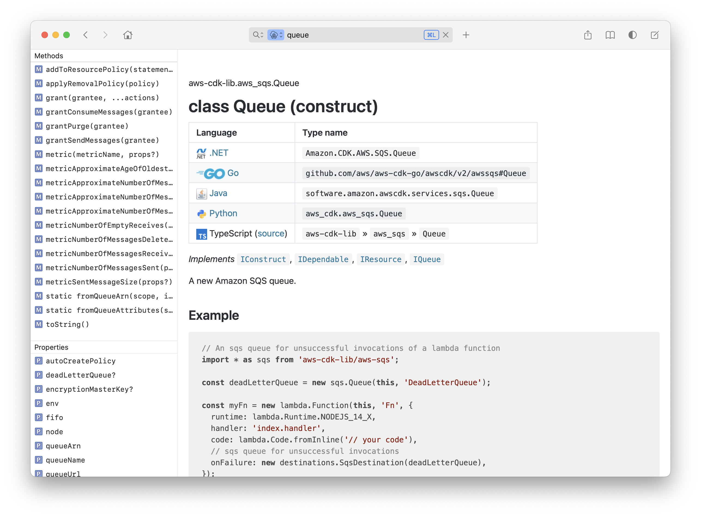

dash-docset-aws-cdk
===================

# Overview

_[AWS CDK](https://docs.aws.amazon.com/cdk/v2/guide/home.html) docset for the [Dash](https://kapeli.com/dash) documentation browser._

This docset is available as a User-Contributed Docset. Download it from Dash directly.

Generated from [AWS CDK API Reference](https://docs.aws.amazon.com/cdk/api/v2/docs/aws-construct-library.html).

Instructions for building Dash docsets are available on the [Dash website](https://kapeli.com/docsets#dashDocset).

The official version of AWS CDK documentation is hosted [here](https://docs.aws.amazon.com/cdk/api/v2/index.html).

_The maintainer of this repository is not affiliated with AWS._



## How to Build

The docset was developed using the following:

- bash
- git
- GNU Make
- GNU Coreutils
- Python 3.10

To build the docset, run:

```bash
make
```

The build will use the currently published version of the AWS CDK API Reference.

The docset will be available at `.build/latest/AWS-CDK.docset` and `.build/latest/AWS-CDK.tgz`. 
